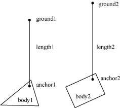

### Pulley Joint
A pulley is used to create an idealized pulley. The pulley connects two
bodies to ground and to each other. As one body goes up, the other goes
down. The total length of the pulley rope is conserved according to the
initial configuration.

```
length1 + length2 == constant
```

You can supply a ratio that simulates a block and tackle. This causes
one side of the pulley to extend faster than the other. At the same time
the constraint force is smaller on one side than the other. You can use
this to create mechanical leverage.

```
length1 + ratio * length2 == constant
```

For example, if the ratio is 2, then length1 will vary at twice the rate
of length2. Also the force in the rope attached to body1 will have half
the constraint force as the rope attached to body2.



Pulleys can be troublesome when one side is fully extended. The rope on
the other side will have zero length. At this point the constraint
equations become singular (bad). You should configure collision shapes
to prevent this.

Here is an example pulley definition:

```js
let anchor1 = myBody1.getWorldCenter();
let anchor2 = myBody2.getWorldCenter();

let groundAnchor1 = Vec2(p1.x, p1.y + 10);
let groundAnchor2 = Vec2(p2.x, p2.y + 12);

let ratio = 1;

new PulleyJoint({}, myBody1, myBody2, groundAnchor1, groundAnchor2, anchor1, anchor2, ratio);
```

Pulley joints provide the current lengths.

```js
pulleyJoint.getLengthA(); // number
pulleyJoint.getLengthB(); // number
```
